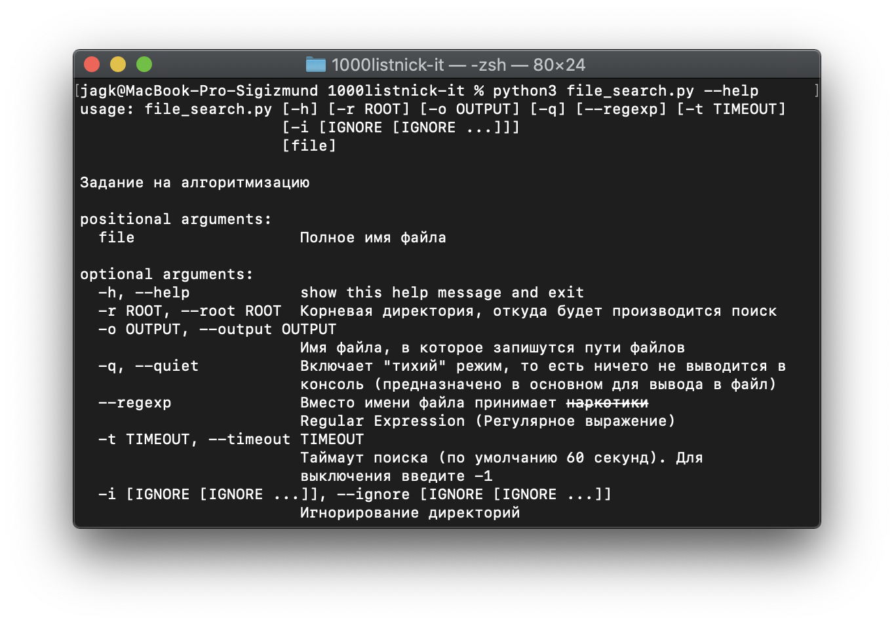

# 1000-LIST-NICK (IT)
🎉 Вы открыли первый этап! 🎉

 - [1 этап](https://github.com/jag-k/1000listnick-it/tree/first-stage)
 - [2 этап](https://github.com/jag-k/1000listnick-it/tree/second-stage)

### ⚠️ ВАЖНО Для работы программы необходимо установить зависимости! ⚠️  

## Как запустить проект? 
1. Для начала, должен быть установлен [`python`⬀](https://www.python.org/downloads/) версии не ниже `3.7` и [`git`⬀](https://git-scm.com/downloads)
1. После установки нужно склонировать проект в удобное для Вас место командой `git clone https://github.com/jag-k/1000listnick-it.git`
1. Затем перейти в папку проекта `cd 1000listnick-it` и выбрать 1-й этап: `git checkout first-stage`
1. Установите зависимости командой `pip install -r reqirements.txt` или `python -m pip install -r reqirements.txt` 
1. Для запуска проекта используйте команду  `python main.py` ИЛИ запустите конкретное задание:
    - 1-е задание (Поиск файла): `python file_search.py`
    - 2-e задание (Рассылка почты): `python email`. **ОБРАТИТЕ ВНИМАНИЕ НА ОТСВУТСВИЕ ПОСТВИКСА `.py`**

## Настройки проекта
Для получения справки добавьте флаг `-h` или `--help` во время запуска задания.
Например: `python file_search.py --help`

Ещё один пример запуска проекта: `python file_search.py .*\.py -o res.txt --regexp -r ./ -i venv .venv --ignore __pycache__` (ищет все `.py` файлы в текущей директории, игнорируя питоновские временные и "системные" файлы, а так же записывает результат в `res.txt` файл)

#### Настройки подключения к базе данных для 2-го задания
Файл для конфигурации: `database_config.json`

Ключ     | Значение по умолчанию | Тип   | Описание
-------- | --------------------- | ----- | ---------------------------
user     | `""`                  | `str` | Логин от базы данных
password | `""`                  | `str` | Пароль от базы данных
host     | `"localhost"`         | `str` | Хост/путь к базе данных
port     | `5432`                | `int` | Порт подключения
database | `"postgres"`          | `str` | Название самой базы данных

## Какие зависимости есть, и зачем они нужны?
Все эти зависимости относятся к 2-му заданию `./email/`
(То есть `file_search.py` можно использовать и без установки этих зависимостей)

Библиотека                                    | Её предназначение
--------------------------------------------- | -----------------
[PonyORM](https://pypi.org/pony)              | Это ORM Для работы с базами данных
[psycopg2cffi](https://pypi.org/psycopg2cffi) | Позволяет работать [PonyORM](https://ponyorm.org) с БД [Postgres](https://www.postgresql.org)

## Мои контакты
Если будут вопросы по проекту, то вот как со мной связаться: 
- [👥 VK](https://vk.com/jag_konon)
- [:octocat: GitHub](https://github.com/jag-k)
- [🌐 Мой вебсайт (да, там ничего нет)](https://jagk.ru)
- [📧 jagk58@ya.ru](mailto:jagk58@ya.ru)
