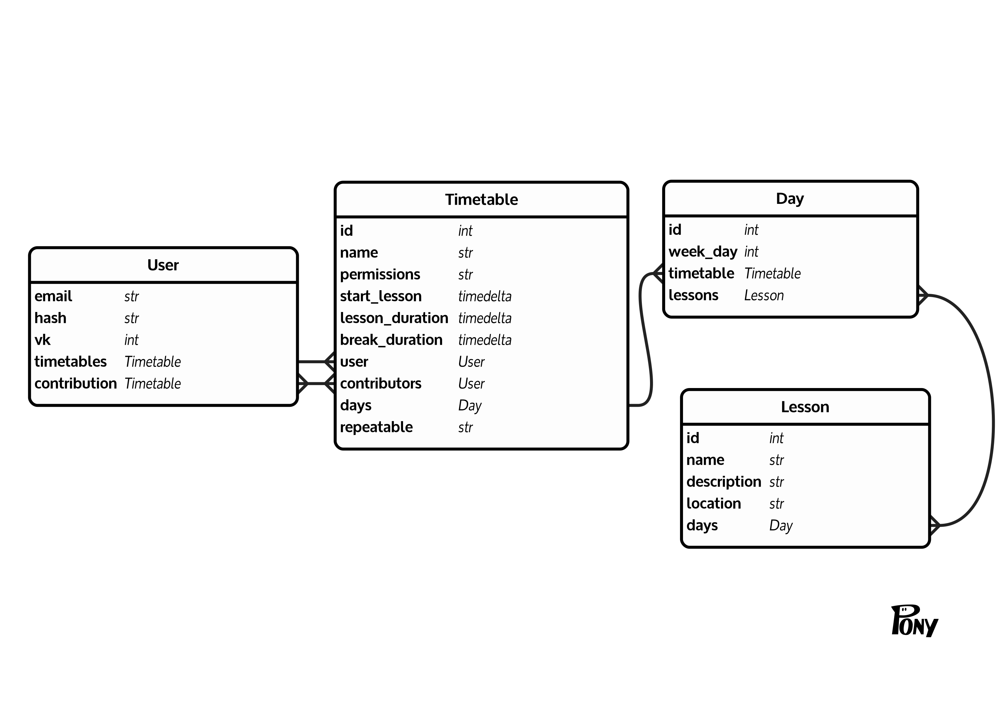

# 1000-LIST-NICK (IT)  
🎉 Вы открыли второй этап! 🎉

[📄 Ссылка на само задание ⬀](https://docs.google.com/document/d/1gkIVum4qibqqsTDvmeISJv3RSmhoE5IPVwsQuP96ru0)

Demo: [1000ln-it.jagk.ru ](https://1000ln-it.jagk.ru/)
 - [1 этап ⬀](https://github.com/jag-k/1000listnick-it/tree/first-stage)
 - [2 этап ⬀](https://github.com/jag-k/1000listnick-it/tree/second-stage)

<h3 align="center"> ⚠️ ВАЖНО Для работы программы необходимо установить зависимости! ⚠️    Как это сделать написано ниже ⇩ </h3>

## Как запустить проект? 
1. Для начала, должен быть установлен [`python`⬀](https://www.python.org/downloads/) версии не ниже `3.6` и [`git`⬀](https://git-scm.com/downloads)
1. После установки нужно склонировать проект в удобное для Вас место командой `git clone https://github.com/jag-k/1000listnick-it.git`
1. Затем перейти в папку проекта `cd 1000listnick-it` и выбрать этап:
    - 1 этап — `git checkout first-step`
    - 2 этап — `git checkout second-step`
1. Для запуска проекта используйте команду `python main.py`

## Какие зависимости есть и зачем они нужны?
Библиотека | Описание
---------- | --------
PonyORM    | Работа с Базой Данных
Sanic      | Веб-сервер
Jinja2     | Template-Engine

## Схема базы данных

## Что ещё использовалось для данного проекта?
Библиотека | Описание
---------- | --------
 | Фреймворк [CodyHose](https://codyhouse.co) использовался для написание Front-end части проекта
 | Сервис для использования баз данных

## Мои контакты
Если будут вопросы по проекту, то вот как со мной связаться: 
- [👥 VK](https://vk.com/jag_konon)
- [:octocat: GitHub](https://github.com/jag-k)
- [🌐 Мой вебсайт (да, там ничего нет)](https://jagk.ru)
- [📧 jagk58@ya.ru](mailto:jagk58@ya.ru)
